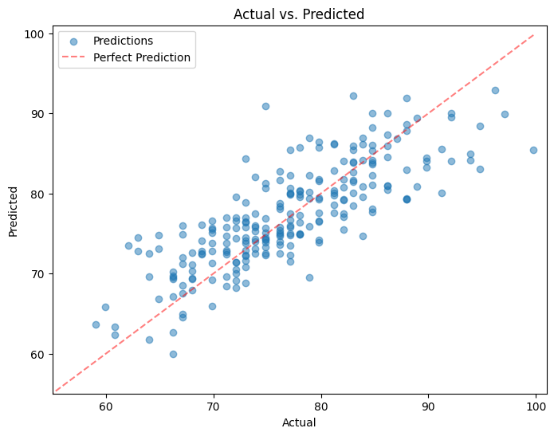
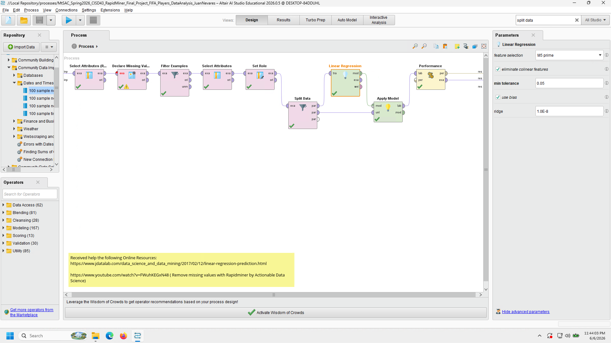
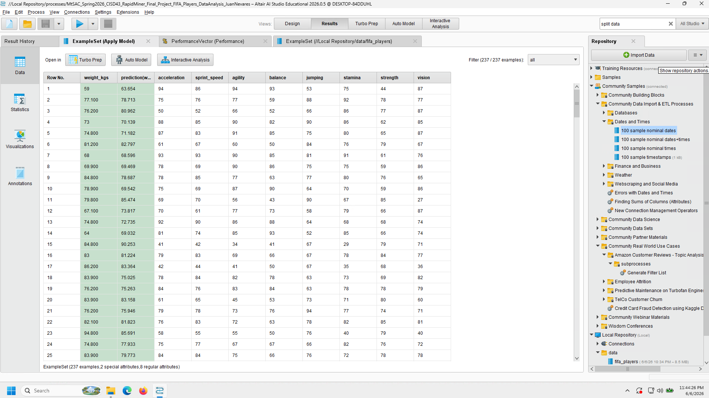
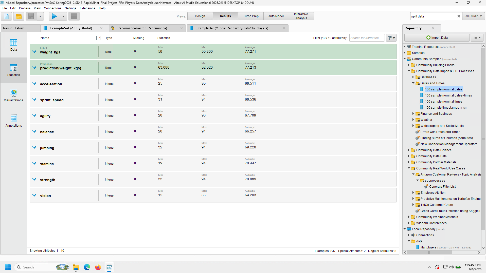
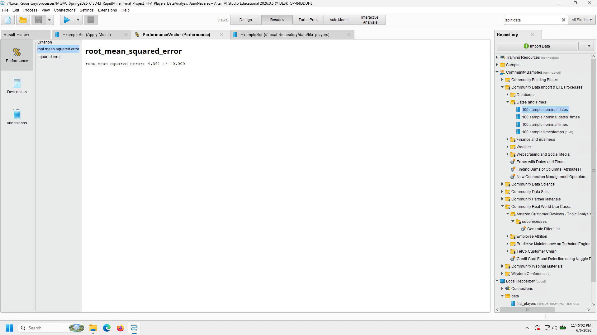
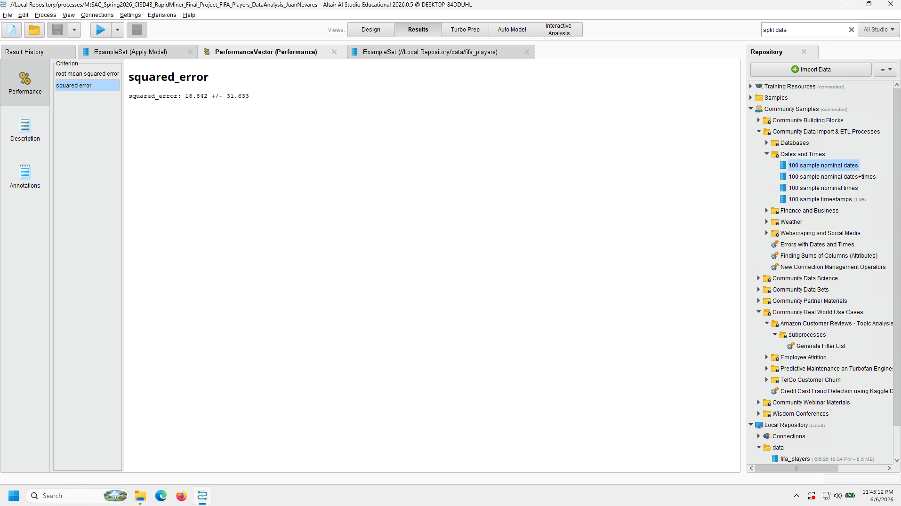
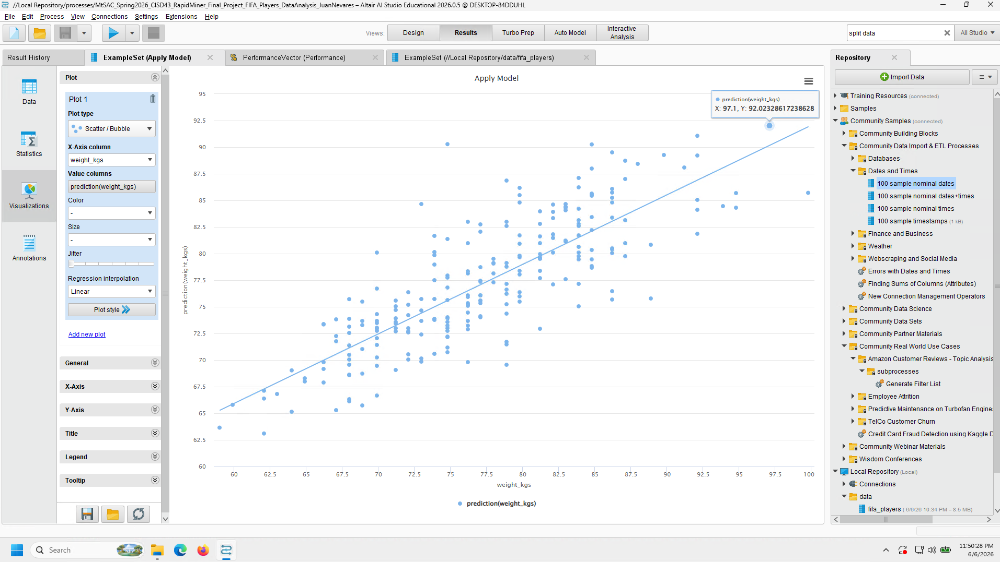

# Explanation

__Note__: Report outputs (.md, .docx, .html, .pdf) from use of QMD open-source scientific and technical publishing system and Pandoc setup within VSCodium (fork without telemetry).

This project aims to perform data analysis, machine learning, and data to database importing through using a dataset containing FIFA Players and the various information, reputations, positions, physical stats, etc. of each respective player. With this amount of information, we can be able to make more accurate analysis or inferences between the various players. A later prediction was applied using Linear Regression machine learning techniques on both Google Colab and RapidMiner to determine a trend in weight (kgs) relative to the FIFA Player's ability stats. The data was also later imported onto a MongoDB Database for later storage of, in a future case, potential big data projects and retrieval.

# Methodology

I started by first looking into the reading the FIFA Players dataset, and ending up meeting a few surprises while importing the data and then applying cleansing.

## Data Reading Output

When first reading it not all of the values of the rows to the right displayed, so I had to look into the Pandas option to display max columns (Non-Truncated view). The rest of the column information could be seen.

## Addressing missing values 

While great of the dataset to have 17954 rows noted for viewing with various attributes, I wasn't interested in all of them and needed to look into removing them for a cleaner dataset. 

## Dropping uninterested attributes

Further cleanup was applied by removing the attributes that I wasn't very familiar with (not a subject matter expert on the sports field), and genuinely has no interest in using further for analysis. 

## Addressing incorrect values 

One thing I noticed was that for body types, the names of some of the players was showing up instead of valid physical body types. I then applied a filtering on the 3 valid physical body types for final cleaning.



# Data Visualization

I then looked into and explored a bit more into visualizing various counts of the attributes, as well as seeing how some physical traits relate per FIFA Player. The following is a list of the visualizations applied (done by either matplotlib and/or seaborn):

- Total Counts Per Body Type of FIFA Players
- Weight (Kilograms) by FIFA Player Body Type
- Agility Value by FIFA Player Body Type
- Total Counts Per International Reputation Rating of FIFA Players
- Total Counts Per Nationality Representation of FIFA Players (Top 15)



# Linear Regression Methodology and Results

After looking into the previous visualizations and results, I decided to try looking into the prediction of weight (kgs) [__target__] of each member based on the following ability stats:

- acceleration
- sprint_speed
- agility
- balance
- jumping
- stamina
- strength
- vision

I was wondering if it would be possible, since, in my mind, I thought that if a person has a low or high weight (kgs), then there would be a trend in alignment in each FIFA players respective ability stats. For example, a person with lower weight may be able to have high agility and sprint_speed, but might have lower stamina and strength to support with that weight class; the opposite could be true for those higher weights, but I didn't know at the time if there could be a correlation until experimenting.

## Working with Pandas and Sklearn (Google Colab)

After creating dataset X (with the ability stats) and y (the target of weight (kgs)), I then worked through the Linear Regression steps of having split data (70% Training, 30% Testing), set the model to Linear Regression, printed out Coefficients and then applied predictions to then graph.

### Pandas and Sklearn (Google Colab) Visualization

## Working with RapidMiner

I worked through a similar method on RapidMiner, though it did take up a bit more time to have the Linear Regression Machine Learning technique work. One thing I did notice in the application of applying a filtering of the attributes and addressing missing/incorrect values was the end result slight more than the cleaned up version when run on Pandas within Google Colab. It's likely I missed a step for cleanup or didn't see it, but it was still fairly similar in size to work with.

### RapidMiner Process

### RapidMiner Data Results

### RapidMiner Data Statistics

### RapidMiner RMS Error

### RapidMiner Squared Error

### RapidMiner Visualization



# MongoDB Data Storage and Retrieval

One of the last things to attempt was being able to import the data onto MongoDB for later retrieval and usage on later projects, if need be. Similar to the previous lab worked on for MongoDB, due to my own preference of having the setup in one place instead of different physical environments, I had worked through installing MongoDB on the Colab environment first and then worked on the import. After setting up the database, collection, and records, I was then able to successfully retrieve data via pprint on a records element, the find method within collection, as well as search through a query on the "Stocky" body type for confirmation. 

# Conclusions

While working on this project, I was able to have a better understanding of how to apply data analysis of larger datasets, and then look into broader insights via data visualizations and machine learning via linear regression techniques on both Google Colab and Python Libraries. The use of RapidMiner also gave me better confidence in researching and experimenting with it's GUI tools to confirm a similar results and functionality of machine learning techniques, especially when viewing the Linear Regression visualization trend showing confirmation of the relation between weight (kgs) and ability stats for the predictions. It was very satisfying to see and know and that I'm able to work through and lean towards the right path of results so long as I kept on trying to apply the correct settings to have similar results on Colab. MongoDB also worked out great in being able to accept data that was in the form of a dataframe, cleaned up after being read CSV. The data retrieval still worked as expected, so it would be great to see it being used in other projects, if need be.

Overall, this project has installed further confidence in my use of Python and other software integral towards their use within Big Data and applying further analysis. I'm quite happy with what I've learned, as well as the output received from working through the various steps.
